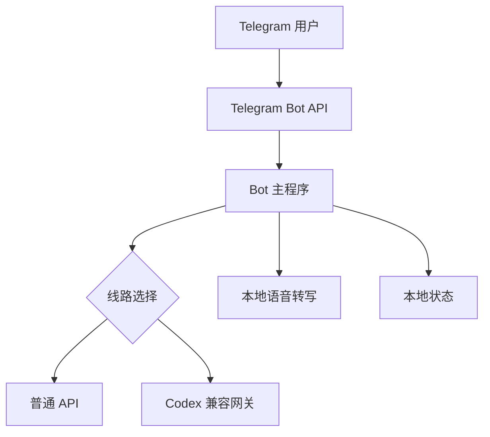

# Codex × Telegram Bot：从零搭建指南

这是一份与操作系统、云厂商和进程管理器解耦的中文教程，目标是把 Telegram Bot 接到两类模型线路：

- 普通 OpenAI 兼容 API
- 本机或服务器上提供 OpenAI 兼容接口的 Codex 网关

教程还覆盖消息合并、动作与话语分气泡、模型和思考档位切换、主动消息、菜单栏、语音转写及上下文辅助纠音。

> 本仓库只讲实现思路并提供通用示例。请使用你有权访问的模型服务，并遵守对应服务条款。仓库不包含任何真实 Token、Key、Cookie、聊天记录、长期记忆或私人角色设定。

## 目录

1. [整体结构](docs/01-architecture.md)
2. [创建 Telegram Bot](docs/02-telegram.md)
3. [接入 API 与 Codex 双线路](docs/03-providers.md)
4. [消息管线：合并、分气泡与菜单](docs/04-messages-and-menu.md)
5. [主动消息](docs/05-proactive.md)
6. [语音转写与上下文辅助](docs/06-voice.md)
7. [运行方式：本机、VPS、Docker](docs/07-running.md)
8. [安全、测试与排错](docs/08-security-and-troubleshooting.md)

## 最小链路

## 快速检查表

- Node.js 20 或更高版本
- 一个由 BotFather 创建的 Telegram Bot
- 至少一条可用模型线路
- 若需要语音：Python 3.10+、FFmpeg、`faster-whisper`
- 长期运行时任选一种守护方式：systemd、PM2、Docker、平台自带进程管理

复制 [`examples/.env.example`](examples/.env.example) 为你自己的环境变量文件，填入真实值。真实配置文件应加入 `.gitignore`。

## 仓库定位

这份教程不会提供绑定某个账号、云厂商或私人机器人的完整成品。各章节给出数据结构、关键流程与可移植示例，方便按自己的部署环境组合。

